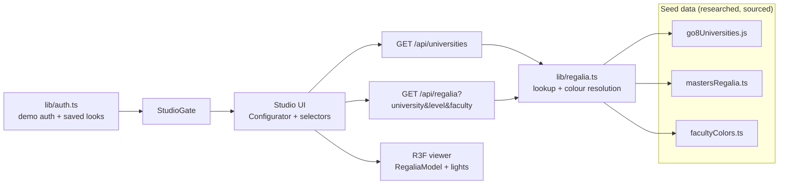

# Grad Choice · Go8 Graduation Regalia Configurator

[](https://github.com/anushagarg-10/go8-regalia-configurator/actions/workflows/ci.yml)

Pick an Australian Group of Eight university, a degree level (Bachelor, Masters, or
PhD), and your faculty, then preview the academic gown, hood, and cap on a boutique
display mannequin in an interactive 3D studio. Share any look as a URL, or download
it as a branded graduation card.

## Feature highlights

- **Live 3D studio**: procedurally built mannequin and regalia (no external model
  assets) with pleated cloth, physically based fabric sheen, soft shadows, contact
  shadows, auto-rotate, and orbit/zoom controls
- **Real, researched data**: gown, hood, and cap rules for all eight Go8
  universities across three degree levels, plus per-faculty hood colours sourced
  from official academic dress regulations and university regalia suppliers
- **Honest fallbacks**: where a colour genuinely varies and no faculty is chosen,
  the app shows a flagged neutral placeholder instead of guessing
- **Shareable looks**: the studio state round-trips through URL params
  (`/studio?uni=uq&level=masters&build=male&finish=deep`), with one-click link
  copying
- **Graduation card export**: composites the live WebGL canvas into a branded
  1080x1350 PNG entirely client-side
- **Members-only studio**: demo auth (salted SHA-256, localStorage) gates the
  studio, with per-user saved looks; the auth layer mirrors a provider API so
  Supabase can replace it without touching component code
- **Editorial marketing site**: full-screen photo hero with fixed-image
  scroll-over, scroll-triggered reveals, an overlay navbar that solidifies on
  scroll, and a photo-backed CTA band
- **Production hygiene**: CI (lint, tests, build), Open Graph/Twitter metadata,
  JSON-LD structured data, sitemap and robots routes, reduced-motion support

## Architecture



The UI talks to data only through the API routes, and the routes only through
`lib/regalia.ts`, so swapping the local seed files for Supabase later is a
one-module change. The same boundary exists for auth (`lib/auth.ts`).

```
src/data/go8Universities.js    Researched seed data (imported as-is, do not edit)
src/data/go8Universities.d.ts  Types describing the seed data's shape
src/data/mastersRegalia.ts     Supplemental researched masters dress data, with sources
src/data/facultyColors.ts      Researched faculty/degree hood colours per university
src/lib/regalia.ts             Data access + colour resolution (the Supabase swap point)
src/lib/auth.ts                Demo auth + saved looks (the Supabase Auth swap point)
src/lib/lookParams.ts          Studio state <-> URL query round-tripping
src/lib/lookCard.ts            Graduation-card PNG composition
src/app/api/universities/      GET list of universities
src/app/api/regalia/           GET resolved config for uni + level + faculty
src/app/login/                 Graduate portal (sign in / create account)
src/app/studio/                Auth-gated 3D studio
src/components/                Landing sections, selectors, configurator shell
src/components/scene/          R3F mannequin model + studio viewer
```

## Data accuracy

The regalia data covers ANU, Sydney, Melbourne, UQ, UWA, Adelaide, Monash, and
UNSW, sourced from official academic dress regulations and each university's
regalia suppliers (sources recorded per entry in the data files). Caveats the UI
surfaces rather than hides:

- Several universities vary hood colour by faculty. The faculty picker offers
  researched colours for the most common faculties; without a choice, the varying
  slot renders as a flagged grey placeholder, never a made-up colour. UQ has no
  picker because its colours are level-based by regulation (since 1998).
- Hex values approximate named silk colours; nothing is Pantone matched. Nobody
  should order real regalia from this app, and the FAQ says so.
- University marks are shown for identification only via their public site icons;
  the project is independent and unaffiliated.

## Development

```bash
npm install
npm run dev        # http://localhost:3000
npm test           # run the Vitest suite once
npm run lint       # eslint
npm run build      # production build
```

## Tests (51 across 9 files)

- `lib/regalia.test.ts`: data lookup, colour resolution, faculty substitution,
  masters supplement, invalid-input handling
- `lib/auth.test.ts`: signup/signin validation, session lifecycle, hashing,
  saved-look dedupe
- `lib/lookParams.test.ts`: URL round-tripping and fallback behaviour
- `app/api/*/route.test.ts`: API status codes and payloads (200/400/404)
- `components/scene/RegaliaModel.test.tsx`: headless 3D mounts for every
  university/level and material-colour assertions via @react-three/test-renderer
- `components/*.test.tsx`: selector interaction, mannequin controls, studio gate

## Roadmap

- Supabase Auth + Postgres for real accounts and saved looks (the swap points
  are already isolated)
- AI stylist: describe your situation in plain language, get the right selection
- Side-by-side compare mode for two universities
- Playwright end-to-end suite
- Vercel deployment
